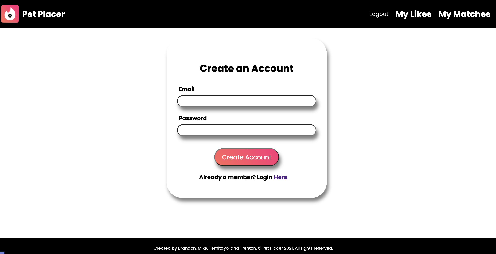
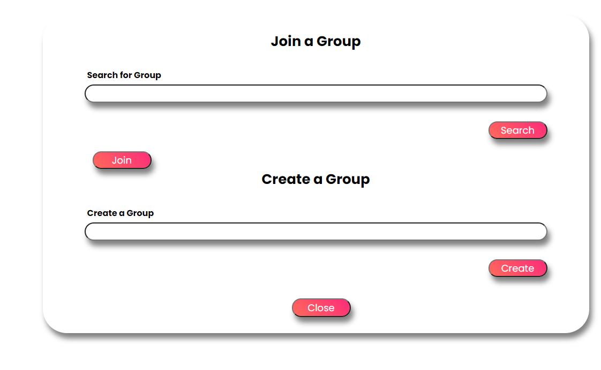

# Table of Contents
1. [Name](#Name)
2. [Preview](#Preview)
2. [Description](#Description)
3. [Installation Instructions](#Installation-Instructions)
4. [Contributions](#Contributions)
5. [Using the App](#UsingTheApp)


# Name
 petplacer 2.0

 # Preview

 ### Homepage
 

 ### MyLikes
  

 ### Groups
 

# Description
A tinder styled application that makes pet adoption an easy and fun experience! While using real pets from the PETFINDER API, you can select which pet you might potentially want to adopt. You may also create or join groups in order discuss different type of pets.

https://petplacer2.herokuapp.com/

# Installation Instructions
1. Clone this repo
2. Type `cd ac-react-adoption` to enter the project folder
3. Run `npm install` or `yarn install` and install dependencies
4. Run `npm run dev` or `yarn dev` and visit [localhost:3000](http://localhost:3000)

# Contributions
 Temitayo Jimoh
 Brandown Cowley
 Michael Zadra
 Trenton Rhines

# Using the App
 To use the app, either login or sign up. You can also use one of our seeded users.
 ```
Email: test@email.com
Password: ffffff

```
From there, you will be redirected to the main page where you will be able to select the Breed, Sex, and Location of the pet you'd like to search for.

You will then be able to click on either the "paw up" to add it to your matches or "paw down" to dismiss the pet.
